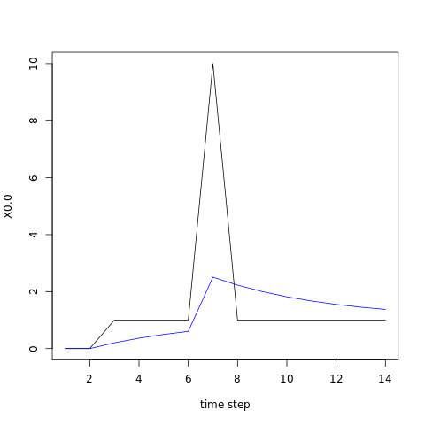

# PI controller with feedforward component

```nim
var ctrl = init_controller(rate=100.0, min= -100.0, max= 100.0)

ctrl.set_gain(kp=1.0, ki=1.0, kf=1.0)

let u = ctrl.update(sp=10.0, pv=1.0, f=1.0)
```


